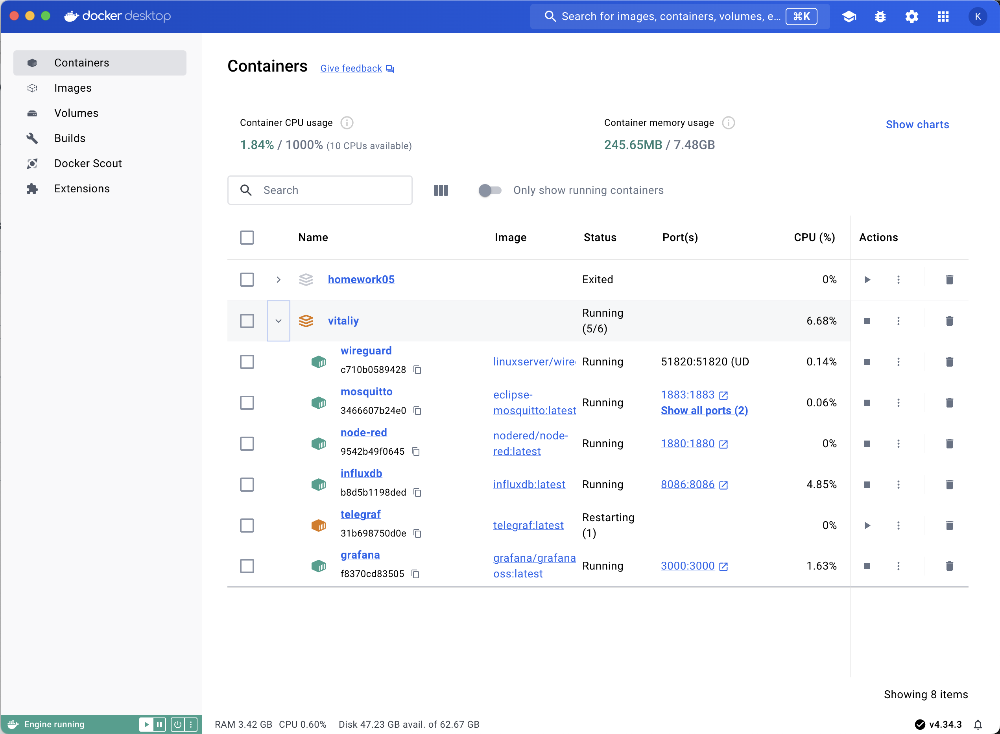
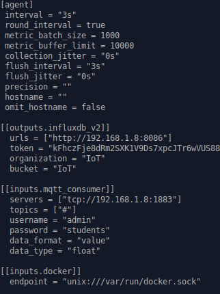
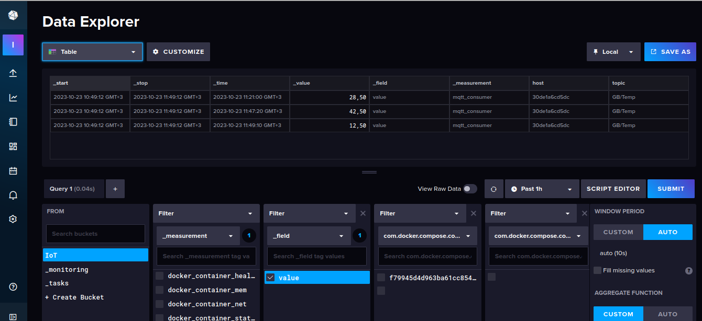
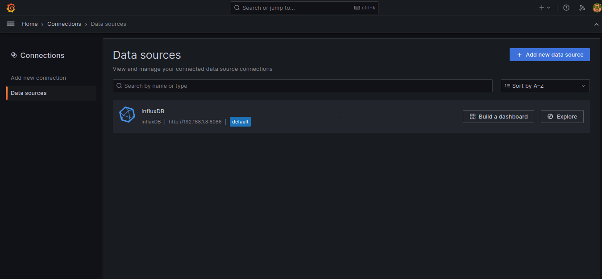
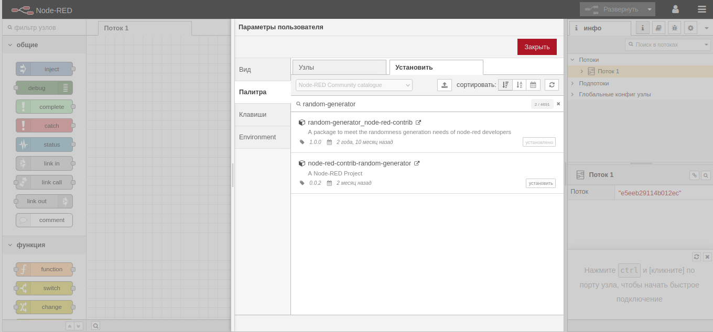
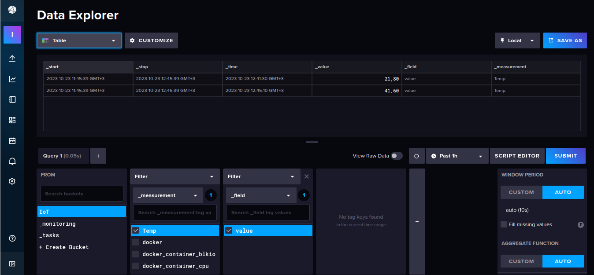

# IoT

Выполнена сборка контейнеров через скрипт install.sh



## Mosquitto

В shell контейнера mosquitto отправка mqtt события из терминала
```
$ docker exec -it mosquitto sh
/ # mosquitto_pub -h 192.168.1.8 -p 1883 -t "GB/Temp" -m "28.5" -u "admin" -P "students"
```

## Telegraf


## InfluxDB


## Grafana


## Node-red


## Результат
